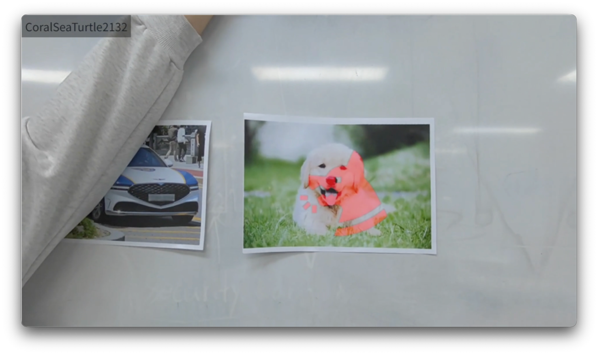

# 소리 시각화 – Unity App

  

  <a href="https://youtu.be/3ByLuGWiPDw">
    <strong>▶ 작동 영상 보기</strong>
  </a>

    메타 퀘스트 PassThrough 화면 위에 주변 소리를 실시간으로 시각화하는 MR 애플리케이션용 Unity 프로젝트입니다. 
    외부 음성 분석 서버에서 전달된 소리 정보와 Meta Quest 카메라 기반 객체 인식 결과를 결합해, 실제 공간에 이모지·경고 UI로 표시합니다.

---

## 1. 관련 저장소

이 Unity App은 별도의 서버 저장소와 함께 동작합니다. 

- [Unity App 저장소](https://github.com/kit-dev-team-2/DevTeam2)

- [서버 저장소](https://github.com/kit-dev-team-2/DevTeam2-Server)  

  - 서버 코드를 클론 및 실행한 뒤, 해당 서버에서 제공하는 WebSocket 주소를 Unity App 설정에 입력해 사용합니다.

> 이 저장소는 **클라이언트(Meta Quest 앱)** 코드만 포함하며, 소리 분류·방향 분석은 서버 저장소에서 수행합니다. 

---

## 2. 개요

- 타깃 디바이스: Meta Quest 3S  
- 엔진: Unity 6  
- 플랫폼: Android (Quest) / XR (Meta XR SDK)  
- 주요 기능:
  - PassThrough 기반 MR 화면 구성
  - YOLOv9-T + Unity Sentis 객체 인식
  - WebSocket을 통한 소리 정보 수신 및 매핑
  - 이모지, 메시지 박스, 테두리 경고 UI 표시 

---

## 3. 개발 환경 및 의존성

- Unity 6 (LTS 권장)  
- Android Build Support  
- XR Plugin Management (OpenXR / Meta XR)  
- Meta XR SDK / Oculus Integration  
- Unity Sentis  
- WebSocket 클라이언트 라이브러리 (예: NativeWebSocket 등)

---

## 4. 빌드/실행 방법

1. **서버 저장소 준비**
   - `DevTeam2-Server` 저장소를 클론합니다. 
   - 서버 README에 따라 의존성 설치 및 실행을 진행합니다.
   - 서버 실행 후, WebSocket 접속 주소(예: `ws://<서버IP>:<포트>` 혹은 서버에서 안내하는 주소)를 확인합니다.

2. **Unity 프로젝트 설정**
   - 이 Unity App 저장소를 클론하고 Unity 6으로 프로젝트를 엽니다. 
   - Build Target을 Android로 변경하고, Meta Quest용 XR 설정을 완료합니다.

3. **서버 주소 설정**
   - 프로젝트 내 설정 스크립트/ScriptableObject(예: `ServerConfig` 등)에 서버 저장소에서 실행 중인 WebSocket 주소를 입력합니다.
   - 또는 앱 실행 시 표시되는 설정 UI에서 서버 주소를 입력/저장하도록 구현된 경우, 해당 UI를 통해 주소를 설정합니다.

4. **빌드 및 실행**
   - Meta Quest 3S 대상으로 앱을 빌드하여 설치합니다. 
   - 헤드셋에서 앱 실행 후, 서버가 실행 중인 상태에서 소리 감지·객체 인식·시각화가 정상적으로 동작하는지 확인합니다.

---

## 5. 동작 개요

- 서버 저장소(DevTeam2-Server):
  - ReSpeaker Mic Array 등의 다중 채널 마이크 입력에서 소리 방향(DOA)과 소리 종류를 분석합니다. 
  - 분석 결과를 JSON 형식으로 WebSocket을 통해 Unity App으로 전송합니다.

- Unity App 저장소(현재 프로젝트):
  - Meta Quest PassThrough 카메라 영상에서 YOLOv9-T로 객체 인식을 수행합니다. 
  - 서버에서 수신한 소리 종류·방향과 객체 인식 결과를 매핑해, 이모지/메시지 박스/테두리 경고로 화면에 시각화합니다.
